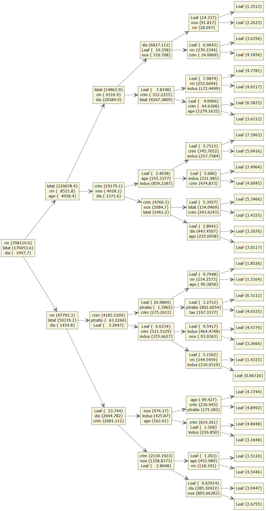

<!-- 
!!!! IMPORTANT: run `source("utils/render.R")` to publish instead of clicking on 'Knit'
# See https://yihui.org/knitr/options/
-->

```{r setup, warning=FALSE, message=TRUE, include=FALSE}
# Set up the environment

# Options relative to figure size
# 1.618 is the golden ratio
figheight <- 4
figwidth <- 4 * 1.618 

# General options
options(knitr.kable.NA = "",
        nsmall = 3,
        tidyverse.quiet = TRUE
        )
hook_output <- knitr::knit_hooks$get('output')

knitr::knit_hooks$set(
  output = function(x, options) {
    if (!is.null(options$max.height)) {
      options$attr.output <- c(options$attr.output,
                               sprintf('style="max-height: %s;"', options$max.height))
    }
    hook_output(x, options)
    }
  )

# Chunk options (see https://yihui.org/knitr/options/#chunk_options)
knitr::opts_chunk$set(
  comment = ">",  # The prefix to be added before each line of the text output.
  dpi = 600,
  fig.path = "docs/figures/",
  fig.height = figheight,
  fig.width = figwidth,
  fig.align = "center",
  # See https://community.rstudio.com/t/centering-images-in-blogdown-post/20962
  # to learn how to center images
  # See https://bookdown.org/yihui/rmarkdown-cookbook/opts-tidy.html
  # See https://www.zotero.org/styles for citation style respository
  tidy='styler',
  tidy.opts=list(strict=TRUE)
)

htmltools::tagList(
  xaringanExtra::use_clipboard(
    button_text = "<i class=\"fa fa-clipboard\"></i> Copy Code",
    success_text = "<i class=\"fa fa-check\" style=\"color: #90BE6D\"></i> Copied!",
  ),
  rmarkdown::html_dependency_font_awesome()
)
```

```{r warning=FALSE, message=FALSE, results='asis', class.source = 'fold-hide'}
# Rmarkdown stuff
library(rmarkdown, quietly=TRUE)
library(knitr, quietly=TRUE)
library(htmltools, quietly=TRUE)
library(styler, quietly=TRUE)
library(xaringanExtra, quietly=TRUE)

# Dataset
library(ISLR2, quietly=TRUE)

# Session info and package reporting
library(report, quietly=TRUE)

# Data wrangling

library(dplyr, quietly=TRUE)
library(magrittr, quietly=TRUE)

# Create interactive tables
library(reactable, quietly=TRUE)

# For plotting

library(ggplot2, quietly=TRUE)
# From github
library(parttree, quietly=TRUE)
library(ConfusionTableR, quietly = TRUE)

# For Decision Classification Trees
library(rpart, quietly=TRUE)
library(rpart.plot, quietly=TRUE)

# For Bagging and Random Forest
library(randomForest, quietly=TRUE)

# For Boosting
library(Ckmeans.1d.dp, quietly=TRUE)
library(xgboost, quietly=TRUE)
library(DiagrammeR, quietly=TRUE)
library(DiagrammeRsvg, quietly=TRUE)
library(rsvg, quietly=TRUE)

# For BART
library(dbarts, quietly=TRUE)
# From github
library(embarcadero, quietly=TRUE)

# For variable importance
library(vip, quietly=TRUE)

# For parallel processing for tuning
library(foreach, quietly=TRUE)
library(doParallel, quietly=TRUE)

# For applying tidymodels

library(rsample, quietly=TRUE)
library(recipes, quietly=TRUE)
library(parsnip, quietly=TRUE)
library(dials, quietly=TRUE)
library(tune, quietly=TRUE)
library(workflows, quietly=TRUE)
library(yardstick, quietly=TRUE)

summary(report::report(sessionInfo()))
```

# Fitting Classification Trees

```{r, echo=FALSE}
set.seed(1234)
```

In the [`Carseats`](https://rdrr.io/cran/ISLR/man/Carseats.html) data set from the `ISLR2` package, `Sales` of child car seats is a continuous variable, and so we begin by recording it as a binary variable called `High`, which takes on a value of Yes if the Sales variable exceeds 8, and takes on a value of No otherwise.

```{r, message=FALSE}

Carseats <- dplyr::as_tibble(ISLR2::Carseats) %>%
  dplyr::mutate(
    High = factor(dplyr::if_else(.data[["Sales"]] <= 8, "No", "Yes"))
    ) %>%
  dplyr::select(-dplyr::all_of(c("Sales")))

Carseats %>%
  reactable::reactable(defaultPageSize = 5,
                       filterable = TRUE)
```

## Create the resample object

First, we split the samples into a training set and a test set. From the training set, we create a 10-fold cross-validation data set from the training set.

This is done with [`rsample::initial_split`](https://rsample.tidymodels.org/reference/initial_split.html),
[`rsample::training`](https://rsample.tidymodels.org/reference/initial_split.html),
[`rsample::testing`](https://rsample.tidymodels.org/reference/initial_split.html)
and
[`rsample::vfold_cv`](https://rsample.tidymodels.org/reference/vfold_cv.html).

```{r, message=FALSE}

Carseats_split <- rsample::initial_split(Carseats)

Carseats_train <- rsample::training(Carseats_split)
Carseats_test <- rsample::testing(Carseats_split)

Carseats_fold <- rsample::vfold_cv(Carseats_train, v = 10)


```

## Create the preprocessor

We create a recipe with [`recipes::recipe`](https://recipes.tidymodels.org/reference/recipe.html).
No other preprocessing step is done.

```{r, message=FALSE}

class_tree_recipe <- 
  recipes::recipe(formula = High ~ ., data = Carseats_train)

```

## Specify the model

Use
[`parsnip::decision_tree`](https://parsnip.tidymodels.org/reference/decision_tree.html),
[`parsnip::set_mode`](https://parsnip.tidymodels.org/reference/set_args.html)
and
[`parsnip::set_engine`](https://parsnip.tidymodels.org/reference/set_engine.html)
to create the model.

The cost complexity is tuned using
[`tune::tune`](https://hardhat.tidymodels.org/reference/tune.html)

An engine specific parameter `model = TRUE` is set for rpart to prevent this warning message from coming up later when `rpart.plot::rpart.plot` is used later.

```{r}
#> Warning: Cannot retrieve the data used to build the model (so cannot determine roundint and is.binary for the variables).
#> To silence this warning:
#>     Call rpart.plot with roundint=FALSE,
#>     or rebuild the rpart model with model=TRUE.
```

```{r, message=FALSE}

class_tree_spec <- parsnip::decision_tree(
  tree_depth = 4,
  cost_complexity = tune::tune()) %>%
  parsnip::set_mode("classification") %>% 
  parsnip::set_engine("rpart", model = TRUE)

class_tree_spec %>%
  parsnip::translate()
```

## Create the workflow

[`workflows::workflow`](https://workflows.tidymodels.org/reference/workflow.html),
[`workflows::add_recipe`](https://workflows.tidymodels.org/reference/add_recipe.html)
and
[`workflows::add_model`](https://workflows.tidymodels.org/reference/add_model.html)
are used.

```{r, message=FALSE, max.height='150px'}

class_tree_workflow <-  workflows::workflow() %>% 
  workflows::add_recipe(class_tree_recipe) %>% 
  workflows::add_model(class_tree_spec)

class_tree_workflow 
```

## Create the cost complexity grid

A cost complexity grid of $10$ numbers from $0.001$ ($10^{-3}$) to
$10$ ($10^1$) is created.

Regular grid is created using
[`dials::grid_regular`](https://dials.tidymodels.org/reference/grid_regular.html),
[`dials::cost_complexity`](https://dials.tidymodels.org/reference/trees.html)
and
[`scales::log10_trans`](https://scales.r-lib.org/reference/log_trans.html)

```{r, message=FALSE}

# Create a range from 10
cost_complexity_grid <- 
  dials::grid_regular(
    x = dials::cost_complexity(range = c(-3, 1),
                               trans = scales::log10_trans()),
    levels = 10
  )

cost_complexity_grid  %>% 
  reactable::reactable(defaultPageSize = 5)
```

## Classification tree model fitting on cross validated data

Now we have everything we need and we can fit all the models on the
cross validated data with
[`tune::tune_grid`](https://tune.tidymodels.org/reference/tune_grid.html).
Note that this process may take some time.

We use [`yardstick::metric_set`](https://yardstick.tidymodels.org/reference/metric_set.html), to choose a set of metrics to used to evaluate the model. In this example, [`yardstick::accuracy`](https://yardstick.tidymodels.org/reference/accuracy.html),
[`yardstick::roc_auc`](https://yardstick.tidymodels.org/reference/roc_curve.html),
[`yardstick::sensitivity`](https://yardstick.tidymodels.org/reference/sens.html) and [`yardstick::specificity`](https://yardstick.tidymodels.org/reference/spec.html) are used.

```{r, message=FALSE}
doParallel::registerDoParallel()
foreach::getDoParWorkers()
```

```{r, message=FALSE, max.height='150px'}
tune_res <- tune::tune_grid(
  object = class_tree_workflow,
  resamples = Carseats_fold, 
  grid = cost_complexity_grid,
  metrics = yardstick::metric_set(yardstick::accuracy,
                                  yardstick::roc_auc,
                                  yardstick::sensitivity, 
                                  yardstick::specificity)
)

tune_res
```

Here we see that the amount of cost complexity affects the performance
metrics differently using
[`tune::autoplot`](https://tune.tidymodels.org/reference/autoplot.tune_results.html).
Do note that using a different seed will give a different plot

```{r, message=FALSE}
# Note that a different seed will give different plots
tune::autoplot(tune_res)
```

We can also see the raw metrics that created this chart by calling
[`tune::collect_metrics()`](https://tune.tidymodels.org/reference/collect_predictions.html).

```{r, message=FALSE, max.height='150px'}

tune::collect_metrics(tune_res) %>% 
  reactable::reactable(defaultPageSize = 5)
```

Here is the `ggplot` way should
[`tune::autoplot`](https://tune.tidymodels.org/reference/autoplot.tune_results.html)
fails

```{r, message=FALSE, max.height='150px'}

tune_res %>%
  tune::collect_metrics() %>%
  ggplot2::ggplot(mapping = ggplot2::aes(x = .data[["cost_complexity"]],
                                         y = .data[["mean"]],
                                         colour = .data[[".metric"]])) +
  ggplot2::geom_errorbar(mapping = ggplot2::aes(ymin = .data[["mean"]] - .data[["std_err"]],
                                                ymax = .data[["mean"]] + .data[["std_err"]]),
                         alpha = 0.5) +
  ggplot2::geom_line(size = 1.5) +
  ggplot2::facet_wrap(facets = ggplot2::vars(.data[[".metric"]]), 
                      scales = "free", 
                      nrow = 2) +
  ggplot2::scale_x_log10() +
  ggplot2::theme(legend.position = "none")
```

Use
[`tune::show_best`](https://tune.tidymodels.org/reference/show_best.html)
to see the top few values for a given metric.

The "best" values can be selected using
[`tune::select_best`](https://tune.tidymodels.org/reference/show_best.html),
this function requires you to specify a metric that it should select
against. The cost complexity value is 0.001 for metric `accuracy` since it
gives the highest value. Do note that using a different seed will give a
different best cost complexity value.

```{r, message=FALSE, max.height='150px'}

top_cost_complexity <- tune::show_best(tune_res, metric = c("accuracy"), n = 5)
top_cost_complexity %>%
  reactable::reactable(defaultPageSize = 5)

best_cost_complexity <- tune::select_best(tune_res, metric = "accuracy")
best_cost_complexity

```

## Classification tree model with optimised cost complexity value

We create the classification tree workflow with the best cost complexity score
using
[`tune::finalize_workflow`](https://tune.tidymodels.org/reference/finalize_model.html).

```{r, message=FALSE, max.height='150px'}

class_tree_final <- tune::finalize_workflow(
  x = class_tree_workflow, 
  parameters = best_cost_complexity)

class_tree_final
```

We now train the classification tree model with the training data using [`parsnip::fit`](https://parsnip.tidymodels.org/reference/fit.html)

```{r, message=FALSE}

class_tree_final_fit <- parsnip::fit(object = class_tree_final, data = Carseats_train)
```

We can see the tree in greater detail using
[`tune::extract_fit_engine`](https://tune.tidymodels.org/reference/extract-tune.html)

```{r, message=FALSE, max.height='150px'}
class_tree_final_fit %>%
  tune::extract_fit_engine()
```

We can visualise the above better with `rpart.plot::rpart.plot`

```{r, message=FALSE, max.height='150px'}
class_tree_final_fit %>%
  tune::extract_fit_engine() %>%
  rpart.plot::rpart.plot()
```

## Variable Importance

What are the most important variables in this tree for predicting `Sales`?

Using the `vip` package and
[`workflows::extract_fit_parsnip`](https://workflows.tidymodels.org/reference/extract-workflow.html), we have

```{r, message=FALSE}

vip_table <- class_tree_final_fit %>%
  workflows::extract_fit_parsnip() %>%
  vip::vi() 

vip_table %>%
  reactable::reactable(defaultPageSize = 5)
```

```{r, message=FALSE}
class_tree_final_fit %>%
  workflows::extract_fit_parsnip() %>%
  vip::vip(geom = "col", 
           aesthetics = list(fill = "midnightblue", alpha = 0.8)) +
  ggplot2::scale_y_continuous(expand = c(0, 0))
```

We can use [`parttree`](https://github.com/grantmcdermott/parttree) to understand why these two parameters work so well on the training set.

However this package only works with two continuous predictors. As `ShelveLoc` is a categorical variable, there is a need to "convert" them to continuous by making "Bad" as -1, "Medium" as 0 and "Good" as 1. 

```{r, message=FALSE}

Carseats_train_modfified <- Carseats_train %>% 
  dplyr::mutate(
    ShelveLoc = dplyr::case_when(
      .data[["ShelveLoc"]] == "Bad" ~ "-1",
      .data[["ShelveLoc"]] == "Medium" ~ "0",
      .data[["ShelveLoc"]] =="Good" ~ "1"
    )) %>% 
  dplyr::mutate(
    ShelveLoc = as.numeric(.data[["ShelveLoc"]])
  )

partial_tree <- parsnip::decision_tree(
  tree_depth = 30,
  cost_complexity = best_cost_complexity$cost_complexity) %>%
  parsnip::set_mode("classification") %>% 
  parsnip::set_engine("rpart", model = TRUE) %>%
  parsnip::fit(High ~ Price + ShelveLoc, 
               data = Carseats_train_modfified) %>%
  tune::extract_fit_engine()

Carseats_train_modfified %>%
  ggplot2::ggplot(
    mapping = ggplot2::aes(x = .data[["ShelveLoc"]],
                           y = .data[["Price"]])) +
  parttree::geom_parttree(
    data = partial_tree, 
    mapping = ggplot2::aes(fill = .data[["High"]]), 
    alpha = 0.2) +
  ggplot2::geom_jitter(alpha = 0.7, 
                       width = 0.05, 
                       height = 0.2, 
                       mapping = ggplot2::aes(color = .data[["High"]]))
```

## Classification tree model on test data

Finally, let’s turn to the testing data.
For classification models, a
`.pred_class`, column and class probability columns named .pred_{level} are added when
[`parsnip::augment`](https://parsnip.tidymodels.org/reference/augment.html)
is used.

```{r, message=FALSE}

test_results <- parsnip::augment(x = class_tree_final_fit, 
                                 new_data = Carseats_test)
  
test_results %>%
  reactable::reactable(defaultPageSize = 5)

```

We can view the confusion matrix using [`yardstick::conf_mat`](https://yardstick.tidymodels.org/reference/conf_mat.html)

```{r, message=FALSE}

test_results %>%
  yardstick::conf_mat(truth = .data[["High"]], 
                      estimate = .data[[".pred_class"]]) %>%
  ggplot2::autoplot(type = "heatmap")
```

```{r, message=FALSE}

test_results %>%
  yardstick::conf_mat(truth = .data[["High"]], estimate = .data[[".pred_class"]]) %>%
  summary() %>%
  reactable::reactable(defaultPageSize = 5)
```

or by `ConfusionTableR::binary_visualiseR`

```{r, message=FALSE, fig.height = 8}
ConfusionTableR::binary_visualiseR(train_labels = test_results[["High"]],
                                   truth_labels = test_results[[".pred_class"]],
                                   class_label1 = "Yes", 
                                   class_label2 = "No",
                                   quadrant_col1 = "#28ACB4", 
                                   quadrant_col2 = "#4397D2", 
                                   custom_title = "High Confusion Matrix", 
                                   text_col= "black")


```

We can view the ROC curve using [`yardstick::roc_curve`](https://yardstick.tidymodels.org/reference/roc_curve.html) 

```{r, message=FALSE}

roc_plot_data <- test_results %>%
  yardstick::roc_curve(truth = test_results[["High"]],
                       .data[[".pred_No"]])

roc_plot_data %>% 
  reactable::reactable(defaultPageSize = 5)
```

```{r, message=FALSE}

roc_plot_data %>% 
  ggplot2::autoplot()

```

Here is a `ggplot2` version.

```{r, message=FALSE}

roc_plot_data %>% 
  ggplot2::ggplot(mapping = ggplot2::aes(x = 1 - .data[["specificity"]], 
                                         y = .data[["sensitivity"]])) +
  ggplot2::geom_line(size = 1.5, color = "midnightblue") +
  ggplot2::geom_abline(
    lty = 2, alpha = 0.5,
    color = "gray50",
    size = 1.2
  ) +
  ggplot2::coord_equal()

```


To view the metrics, we can also use
[`tune::last_fit`](https://tune.tidymodels.org/reference/last_fit.html)
and
[`tune::collect_metrics`](https://tune.tidymodels.org/reference/collect_predictions.html).


```{r, message=FALSE}

metrics_results <- tune::last_fit(object = class_tree_final_fit, 
                                  split = Carseats_split) %>%
  tune::collect_metrics()
  
metrics_results %>%
  reactable::reactable(defaultPageSize = 5)
  
```

# Fitting Regression Trees

```{r, echo=FALSE}
set.seed(1234)
```

In the [`Boston`](https://rdrr.io/cran/ISLR2/man/Boston.html) data set from the `ISLR2` package, we want to predict `medv`, the median value of owner-occupied homes in $1000's.

```{r, message=FALSE}

Boston <- dplyr::as_tibble(ISLR2::Boston)

Boston %>%
  reactable::reactable(defaultPageSize = 5,
                       filterable = TRUE)
```

## Create the resample object

First, we split the samples into a training set and a test set. From the training set, we create a 10-fold cross-validation data set from the training set.

This is done with [`rsample::initial_split`](https://rsample.tidymodels.org/reference/initial_split.html),
[`rsample::training`](https://rsample.tidymodels.org/reference/initial_split.html),
[`rsample::testing`](https://rsample.tidymodels.org/reference/initial_split.html)
and
[`rsample::vfold_cv`](https://rsample.tidymodels.org/reference/vfold_cv.html).

```{r, message=FALSE}

Boston_split <- rsample::initial_split(Boston)

Boston_train <- rsample::training(Boston_split)
Boston_test <- rsample::testing(Boston_split)

Boston_fold <- rsample::vfold_cv(Boston_train, v = 10)


```

## Create the preprocessor

We create a recipe with [`recipes::recipe`](https://recipes.tidymodels.org/reference/recipe.html).
No other preprocessing step is done.

```{r, message=FALSE}

reg_tree_recipe <- 
  recipes::recipe(formula = medv ~ ., data = Boston_train)

```

## Specify the model

Use
[`parsnip::decision_tree`](https://parsnip.tidymodels.org/reference/decision_tree.html),
[`parsnip::set_mode`](https://parsnip.tidymodels.org/reference/set_args.html)
and
[`parsnip::set_engine`](https://parsnip.tidymodels.org/reference/set_engine.html)
to create the model.

The cost complexity is tuned using
[`tune::tune`](https://hardhat.tidymodels.org/reference/tune.html)

An engine specific parameter `model = TRUE` is set for rpart to prevent this warning message from coming up later when `rpart.plot::rpart.plot` is used later.

```{r}
#> Warning: Cannot retrieve the data used to build the model (so cannot determine roundint and is.binary for the variables).
#> To silence this warning:
#>     Call rpart.plot with roundint=FALSE,
#>     or rebuild the rpart model with model=TRUE.
```

```{r, message=FALSE}

reg_tree_spec <- parsnip::decision_tree(
  #tree_depth = 4,
  cost_complexity = tune::tune()) %>%
  parsnip::set_mode("regression") %>% 
  parsnip::set_engine("rpart", model = TRUE)

reg_tree_spec %>%
  parsnip::translate()
```

## Create the workflow

[`workflows::workflow`](https://workflows.tidymodels.org/reference/workflow.html),
[`workflows::add_recipe`](https://workflows.tidymodels.org/reference/add_recipe.html)
and
[`workflows::add_model`](https://workflows.tidymodels.org/reference/add_model.html)
are used.

```{r, message=FALSE, max.height='150px'}

reg_tree_workflow <-  workflows::workflow() %>% 
  workflows::add_recipe(reg_tree_recipe) %>% 
  workflows::add_model(reg_tree_spec)

reg_tree_workflow 
```

## Create the cost complexity grid

A cost complexity grid of $10$ numbers from $0.001$ ($10^{-4}$) to
$10$ ($10^1$) is created.

Regular grid is created using
[`dials::grid_regular`](https://dials.tidymodels.org/reference/grid_regular.html),
[`dials::cost_complexity`](https://dials.tidymodels.org/reference/trees.html)
and
[`scales::log10_trans`](https://scales.r-lib.org/reference/log_trans.html)

```{r, message=FALSE}

# Create a range from 10
cost_complexity_grid <- 
  dials::grid_regular(
    x = dials::cost_complexity(range = c(-4, 1),
                               trans = scales::log10_trans()),
    levels = 10
  )

cost_complexity_grid  %>% 
  reactable::reactable(defaultPageSize = 5)
```

## Regression tree model fitting on cross validated data

Now we have everything we need and we can fit all the models on the
cross validated data with
[`tune::tune_grid`](https://tune.tidymodels.org/reference/tune_grid.html).
Note that this process may take some time.

We use [`yardstick::metric_set`](https://yardstick.tidymodels.org/reference/metric_set.html), to choose a set of metrics to used to evaluate the model. In this example, [`yardstick::rmse`](https://yardstick.tidymodels.org/reference/rmse.html) and
[`yardstick::rsq`](https://yardstick.tidymodels.org/reference/rsq.html) are used.

```{r, message=FALSE}
doParallel::registerDoParallel()
foreach::getDoParWorkers()
```

```{r, message=FALSE, max.height='150px'}
tune_res <- tune::tune_grid(
  object = reg_tree_workflow,
  resamples = Boston_fold, 
  grid = cost_complexity_grid,
  #metrics = yardstick::metric_set(yardstick::rmse,
  #                                yardstick::rsq)
)

tune_res
```

Here we see that the amount of cost complexity affects the performance
metrics differently using
[`tune::autoplot`](https://tune.tidymodels.org/reference/autoplot.tune_results.html).
Do note that using a different seed will give a different plot

```{r, message=FALSE}
# Note that a different seed will give different plots
tune::autoplot(tune_res)
```

We can also see the raw metrics that created this chart by calling
[`tune::collect_metrics()`](https://tune.tidymodels.org/reference/collect_predictions.html).

```{r, message=FALSE, max.height='150px'}

tune::collect_metrics(tune_res) %>% 
  reactable::reactable(defaultPageSize = 5)
```

Here is the `ggplot` way should
[`tune::autoplot`](https://tune.tidymodels.org/reference/autoplot.tune_results.html)
fails

```{r, message=FALSE, max.height='150px'}

tune_res %>%
  tune::collect_metrics() %>%
  ggplot2::ggplot(mapping = ggplot2::aes(x = .data[["cost_complexity"]],
                                         y = .data[["mean"]],
                                         colour = .data[[".metric"]])) +
  ggplot2::geom_errorbar(mapping = ggplot2::aes(ymin = .data[["mean"]] - .data[["std_err"]],
                                                ymax = .data[["mean"]] + .data[["std_err"]]),
                         alpha = 0.5) +
  ggplot2::geom_line(size = 1.5) +
  ggplot2::facet_wrap(facets = ggplot2::vars(.data[[".metric"]]), 
                      scales = "free", 
                      nrow = 2) +
  ggplot2::scale_x_log10() +
  ggplot2::theme(legend.position = "none")
```

Use
[`tune::show_best`](https://tune.tidymodels.org/reference/show_best.html)
to see the top few values for a given metric.

The "best" values can be selected using
[`tune::select_best`](https://tune.tidymodels.org/reference/show_best.html),
this function requires you to specify a metric that it should select
against. The cost complexity value is 0.00129 for metric `rmse` since it
gives the lowest value. Do note that using a different seed will give a
different best cost complexity value.

```{r, message=FALSE, max.height='150px'}

top_cost_complexity <- tune::show_best(tune_res, metric = c("rmse"), n = 5)
top_cost_complexity %>%
  reactable::reactable(defaultPageSize = 5)

best_cost_complexity <- tune::select_best(tune_res, metric = "rmse")
best_cost_complexity

```

## Regression tree model with optimised cost complexity value

We create the regression tree workflow with the best cost complexity score
using
[`tune::finalize_workflow`](https://tune.tidymodels.org/reference/finalize_model.html).

```{r, message=FALSE, max.height='150px'}

reg_tree_final <- tune::finalize_workflow(
  x = reg_tree_workflow, 
  parameters = best_cost_complexity)

reg_tree_final
```

We now train the regression tree model with the training data using [`parsnip::fit`](https://parsnip.tidymodels.org/reference/fit.html)

```{r, message=FALSE}

reg_tree_final_fit <- parsnip::fit(object = reg_tree_final, data = Boston_train)
```

We can see the tree in greater detail using
[`tune::extract_fit_engine`](https://tune.tidymodels.org/reference/extract-tune.html)

```{r, message=FALSE, max.height='150px'}
reg_tree_final_fit %>%
  tune::extract_fit_engine()
```

We can visualise the above better with `rpart.plot::rpart.plot`

```{r, message=FALSE, max.height='150px'}
reg_tree_final_fit %>%
  tune::extract_fit_engine() %>%
  rpart.plot::rpart.plot()
```

## Variable Importance

What are the most important variables in this tree for predicting `medv`?

Using the `vip` package and
[`workflows::extract_fit_parsnip`](https://workflows.tidymodels.org/reference/extract-workflow.html), we have

```{r, message=FALSE}

vip_table <- reg_tree_final_fit %>%
  workflows::extract_fit_parsnip() %>%
  vip::vi() 

vip_table %>%
  reactable::reactable(defaultPageSize = 5)
```

```{r, message=FALSE}
reg_tree_final_fit %>%
  workflows::extract_fit_parsnip() %>%
  vip::vip(geom = "col", 
           aesthetics = list(fill = "midnightblue", alpha = 0.8)) +
  ggplot2::scale_y_continuous(expand = c(0, 0))
```

We can use [`parttree`](https://github.com/grantmcdermott/parttree) to understand why these two parameters work so well on the training set.

```{r, message=FALSE}

partial_tree <- parsnip::decision_tree(
  cost_complexity = best_cost_complexity$cost_complexity) %>%
  parsnip::set_mode("regression") %>% 
  parsnip::set_engine("rpart", model = TRUE) %>%
  parsnip::fit(medv ~ rm + lstat, 
               data = Boston_train) %>%
  tune::extract_fit_engine()

Boston_train %>%
  ggplot2::ggplot(
    mapping = ggplot2::aes(x = .data[["rm"]],
                           y = .data[["lstat"]])) +
  parttree::geom_parttree(
    data = partial_tree, 
    mapping = ggplot2::aes(fill = .data[["medv"]]), 
    alpha = 0.2) +
  ggplot2::geom_jitter(alpha = 0.7,
                       width = 0.05,
                       height = 0.2,
                       mapping = ggplot2::aes(color = .data[["medv"]])) +
  ggplot2::scale_colour_viridis_c(aesthetics = c("color", "fill"))
```

## Regression tree model on test data

Finally, let’s turn to the testing data.
For regression models, a
`.pred`, column is added when
[`parsnip::augment`](https://parsnip.tidymodels.org/reference/augment.html)
is used.

```{r, message=FALSE}

test_results <- parsnip::augment(x = reg_tree_final_fit, 
                                 new_data = Boston_test)
  
test_results %>%
  reactable::reactable(defaultPageSize = 5)

```

We check how well the `.pred` column matches the `medv` using
[`yardstick::rmse`](https://yardstick.tidymodels.org/reference/rmse.html).

```{r, message=FALSE}
test_results %>%
  yardstick::rmse(truth = .data[["medv"]], estimate = .data[[".pred"]]) %>%
  reactable::reactable(defaultPageSize = 5)
```

Alternatively, we can use
[`tune::last_fit`](https://tune.tidymodels.org/reference/last_fit.html)
and
[`tune::collect_metrics`](https://tune.tidymodels.org/reference/collect_predictions.html).

```{r, message=FALSE}

test_rs <- tune::last_fit(object = reg_tree_final_fit, 
                          split = Boston_split)
  
test_rs %>%
  tune::collect_metrics() %>%
  reactable::reactable(defaultPageSize = 5)
  
```

Use [`tune::collect_predictions`](https://tune.tidymodels.org/reference/collect_predictions.html), to see only the actual and predicted values of the test data.

```{r, message=FALSE}
test_rs %>%
  tune::collect_predictions() %>%
  reactable::reactable(defaultPageSize = 5)
```

Let us take a closer look at the predicted and actual response as a scatter plot.

```{r, message=FALSE}
test_rs %>%
  tune::collect_predictions() %>%
  ggplot2::ggplot(mapping = ggplot2::aes(x = .data[["medv"]],
                                         y = .data[[".pred"]]
                                         )
                  ) +
  ggplot2::geom_abline(slope = 1, lty = 2, color = "gray50", alpha = 0.5) +
  ggplot2::geom_point(alpha = 0.6, color = "midnightblue") +
  ggplot2::coord_fixed()
```

# Bagging

Here we apply bagging to the `Boston` data, using the `randomForest` package in R

```{r, echo=FALSE}
set.seed(1)
```

## Create the resample object

First, we split the samples into a training set and a test set. From the training set, we create a 10-fold cross-validation data set from the training set.

This is done with [`rsample::initial_split`](https://rsample.tidymodels.org/reference/initial_split.html),
[`rsample::training`](https://rsample.tidymodels.org/reference/initial_split.html) and
[`rsample::testing`](https://rsample.tidymodels.org/reference/initial_split.html)

```{r, message=FALSE}

Boston_split <- rsample::initial_split(Boston)

Boston_train <- rsample::training(Boston_split)
Boston_test <- rsample::testing(Boston_split)

```

## Create the preprocessor

We create a recipe with [`recipes::recipe`](https://recipes.tidymodels.org/reference/recipe.html).
No other preprocessing step is done.

```{r, message=FALSE}

bagging_recipe <- 
  recipes::recipe(formula = medv ~ ., data = Boston_train)

```

## Specify the model

Use
[`parsnip::rand_forest`](https://parsnip.tidymodels.org/reference/rand_forest.html),
[`parsnip::set_mode`](https://parsnip.tidymodels.org/reference/set_args.html)
and
[`parsnip::set_engine`](https://parsnip.tidymodels.org/reference/set_engine.html)
to create the model.

`mtry` is the number of predictors that will be randomly sampled at each split when creating the tree models. For bagging, that number is the number of columns in the predictor matrix denoted by [`parsnip::.cols`](https://parsnip.tidymodels.org/reference/descriptors.html)

`importance` set to TRUE ensures the importance of predictors are assessed.

```{r, message=FALSE}

bagging_spec <- parsnip::rand_forest(mtry = .cols()) %>%
  parsnip::set_engine("randomForest", importance = TRUE) %>%
  parsnip::set_mode("regression")

bagging_spec %>%
  parsnip::translate()
```

## Create the workflow

[`workflows::workflow`](https://workflows.tidymodels.org/reference/workflow.html),
[`workflows::add_recipe`](https://workflows.tidymodels.org/reference/add_recipe.html)
and
[`workflows::add_model`](https://workflows.tidymodels.org/reference/add_model.html)
are used.

```{r, message=FALSE, max.height='150px'}

bagging_workflow <-  workflows::workflow() %>% 
  workflows::add_recipe(bagging_recipe) %>% 
  workflows::add_model(bagging_spec)

bagging_workflow 
```

## Bagging model on training data

```{r, message=FALSE}

bagging_fit <- parsnip::fit(object = bagging_workflow, 
                            data = Boston_train)
```

## Variable Importance

What are the most important variables in this tree for predicting `medv`?

Using the `vip` package and
[`workflows::extract_fit_parsnip`](https://workflows.tidymodels.org/reference/extract-workflow.html), we have

```{r, message=FALSE}

vip_table <- bagging_fit %>%
  workflows::extract_fit_parsnip() %>%
  vip::vi() 

vip_table %>%
  reactable::reactable(defaultPageSize = 5)
```

```{r, message=FALSE}
bagging_fit %>%
  workflows::extract_fit_parsnip() %>%
  vip::vip(geom = "col", 
           aesthetics = list(fill = "midnightblue", alpha = 0.8)) +
  ggplot2::scale_y_continuous(expand = c(0, 0))
```

## Bagging model on test data

Finally, let’s turn to the testing data.
For regression models, a
`.pred`, column is added when
[`parsnip::augment`](https://parsnip.tidymodels.org/reference/augment.html)
is used.

```{r, message=FALSE}

test_results <- parsnip::augment(x = bagging_fit, 
                                 new_data = Boston_test)
  
test_results %>%
  reactable::reactable(defaultPageSize = 5)

```

We check how well the `.pred` column matches the `medv` using
[`yardstick::rmse`](https://yardstick.tidymodels.org/reference/rmse.html).

```{r, message=FALSE}
test_results %>%
  yardstick::rmse(truth = .data[["medv"]], estimate = .data[[".pred"]]) %>%
  reactable::reactable(defaultPageSize = 5)
```

Let us take a closer look at the predicted and actual response as a scatter plot.

```{r, message=FALSE}
test_results %>%
  ggplot2::ggplot(mapping = ggplot2::aes(x = .data[["medv"]],
                                         y = .data[[".pred"]]
                                         )
                  ) +
  ggplot2::geom_abline(slope = 1, lty = 2, color = "gray50", alpha = 0.5) +
  ggplot2::geom_point(alpha = 0.6, color = "midnightblue") +
  ggplot2::coord_fixed()
```

# Random Forest

Here we apply random forest to the `Boston` data, using the `randomForest` package in R

```{r, echo=FALSE}
set.seed(1)
```

## Create the rsample object

First, we split the samples into a training set and a test set. From the training set, we create a 10-fold cross-validation data set from the training set.

This is done with [`rsample::initial_split`](https://rsample.tidymodels.org/reference/initial_split.html),
[`rsample::training`](https://rsample.tidymodels.org/reference/initial_split.html) and
[`rsample::testing`](https://rsample.tidymodels.org/reference/initial_split.html)

```{r, message=FALSE}

Boston_split <- rsample::initial_split(Boston)

Boston_train <- rsample::training(Boston_split)
Boston_test <- rsample::testing(Boston_split)

```

## Create the preprocessor

We create a recipe with [`recipes::recipe`](https://recipes.tidymodels.org/reference/recipe.html).
No other preprocessing step is done.

```{r, message=FALSE}

rf_recipe <- 
  recipes::recipe(formula = medv ~ ., data = Boston_train)

```

## Specify the model

Use
[`parsnip::rand_forest`](https://parsnip.tidymodels.org/reference/rand_forest.html),
[`parsnip::set_mode`](https://parsnip.tidymodels.org/reference/set_args.html)
and
[`parsnip::set_engine`](https://parsnip.tidymodels.org/reference/set_engine.html)
to create the model.

`mtry` is the number of predictors that will be randomly sampled at each split when creating the tree models. For random forest, the `randomForest::randomForest` use $\frac{p}{3}$ variables when building a random forest of regression trees and $\sqrt{p}$ variables when building a random forest of classification trees.

`importance` set to TRUE ensures the importance of predictors are assessed.

```{r, message=FALSE}

rf_spec <- parsnip::rand_forest() %>%
  parsnip::set_engine("randomForest", importance = TRUE) %>%
  parsnip::set_mode("regression")

rf_spec %>%
  parsnip::translate()
```

## Create the workflow

[`workflows::workflow`](https://workflows.tidymodels.org/reference/workflow.html),
[`workflows::add_recipe`](https://workflows.tidymodels.org/reference/add_recipe.html)
and
[`workflows::add_model`](https://workflows.tidymodels.org/reference/add_model.html)
are used.

```{r, message=FALSE, max.height='150px'}

rf_workflow <-  workflows::workflow() %>% 
  workflows::add_recipe(rf_recipe) %>% 
  workflows::add_model(rf_spec)

rf_workflow 
```

## Random forest on training data

```{r, message=FALSE}

rf_fit <- parsnip::fit(object = rf_workflow, 
                            data = Boston_train)
```

## Variable Importance

What are the most important variables in this tree for predicting `medv`?

Using the `vip` package and
[`workflows::extract_fit_parsnip`](https://workflows.tidymodels.org/reference/extract-workflow.html), we have

```{r, message=FALSE}

vip_table <- rf_fit %>%
  workflows::extract_fit_parsnip() %>%
  vip::vi() 

vip_table %>%
  reactable::reactable(defaultPageSize = 5)
```

```{r, message=FALSE}
rf_fit %>%
  workflows::extract_fit_parsnip() %>%
  vip::vip(geom = "col", 
           aesthetics = list(fill = "midnightblue", alpha = 0.8)) +
  ggplot2::scale_y_continuous(expand = c(0, 0))
```

The `randomForest` package also has functions like `randomForest::importance` to view the importance of each variable as well. The key is to use [`workflows::extract_fit_engine`](https://workflows.tidymodels.org/reference/extract-workflow.html)

The first is based upon the mean decrease of accuracy in predictions on the out of bag samples when a given variable is permuted. 

The second is a measure of the total decrease in node impurity that results from splits over that variable, averaged over all trees.

```{r, message=FALSE}

importance_table <- rf_fit %>%
  workflows::extract_fit_engine() %>%
  randomForest::importance()
  
importance_table %>%
  reactable::reactable(defaultPageSize = 5)
```

Plots of these importance measures can be produced using the `randomForest::varImpPlot` function.

```{r, message=FALSE}

rf_fit %>%
  workflows::extract_fit_engine() %>% 
  randomForest::varImpPlot()

```

## Random forest on test data

Finally, let’s turn to the testing data.
For regression models, a
`.pred`, column is added when
[`parsnip::augment`](https://parsnip.tidymodels.org/reference/augment.html)
is used.

```{r, message=FALSE}

test_results <- parsnip::augment(x = rf_fit, 
                                 new_data = Boston_test)
  
test_results %>%
  reactable::reactable(defaultPageSize = 5)

```

We check how well the `.pred` column matches the `medv` using
[`yardstick::rmse`](https://yardstick.tidymodels.org/reference/rmse.html).

```{r, message=FALSE}
test_results %>%
  yardstick::rmse(truth = .data[["medv"]], estimate = .data[[".pred"]]) %>%
  reactable::reactable(defaultPageSize = 5)
```

Let us take a closer look at the predicted and actual response as a scatter plot.

```{r, message=FALSE}
test_results %>%
  ggplot2::ggplot(mapping = ggplot2::aes(x = .data[["medv"]],
                                         y = .data[[".pred"]]
                                         )
                  ) +
  ggplot2::geom_abline(slope = 1, lty = 2, color = "gray50", alpha = 0.5) +
  ggplot2::geom_point(alpha = 0.6, color = "midnightblue") +
  ggplot2::coord_fixed()
```

# Boosting

Here we apply bagging to the `Boston` data. The book uses the R package `gbm` to do the boosting. Unfortunately, `gbm` is not one of the list boosted tree models in the current [parsnip list](https://parsnip.tidymodels.org/reference/boost_tree.html).

The process of building it from scratch can be found in this [github issue post](https://github.com/tidymodels/parsnip/issues/220)

For simplicity, a different R package is used to create a bagging tree model. In this example, the default parsnip engine for boosted tree is the `xgboost` R package.

```{r, echo=FALSE}
set.seed(1)
```

## Create the resample object

First, we split the samples into a training set and a test set. From the training set, we create a 10-fold cross-validation data set from the training set.

This is done with [`rsample::initial_split`](https://rsample.tidymodels.org/reference/initial_split.html),
[`rsample::training`](https://rsample.tidymodels.org/reference/initial_split.html),
[`rsample::testing`](https://rsample.tidymodels.org/reference/initial_split.html)
and
[`rsample::vfold_cv`](https://rsample.tidymodels.org/reference/vfold_cv.html).

```{r, message=FALSE}

Boston_split <- rsample::initial_split(Boston)

Boston_train <- rsample::training(Boston_split)
Boston_test <- rsample::testing(Boston_split)

Boston_fold <- rsample::vfold_cv(Boston_train, v = 10)


```

## Create the preprocessor

We create a recipe with [`recipes::recipe`](https://recipes.tidymodels.org/reference/recipe.html).
No other preprocessing step is done.

```{r, message=FALSE}

boost_recipe <- 
  recipes::recipe(formula = medv ~ ., data = Boston_train)

```

## Specify the model

Use
[`parsnip::boost_tree`](https://parsnip.tidymodels.org/reference/boost_tree.html),
[`parsnip::set_mode`](https://parsnip.tidymodels.org/reference/set_args.html)
and
[`parsnip::set_engine`](https://parsnip.tidymodels.org/reference/set_engine.html)
to create the model.

Recall in the book that we can tune the number of trees `trees`, the shrinkage parameter `learn_rate` and the number of splits/depth `tree_depth`.

These can be tuned using [`tune::tune`](https://hardhat.tidymodels.org/reference/tune.html)

```{r, message=FALSE}

boost_spec <- parsnip::boost_tree(
  trees = tune::tune(),
  tree_depth = tune::tune(),
  learn_rate = tune::tune()
  ) %>%
  parsnip::set_mode("regression") %>% 
  parsnip::set_engine("xgboost")

boost_spec %>%
  parsnip::translate()
```

## Create the workflow

[`workflows::workflow`](https://workflows.tidymodels.org/reference/workflow.html),
[`workflows::add_recipe`](https://workflows.tidymodels.org/reference/add_recipe.html)
and
[`workflows::add_model`](https://workflows.tidymodels.org/reference/add_model.html)
are used.

```{r, message=FALSE, max.height='150px'}

boost_workflow <-  workflows::workflow() %>% 
  workflows::add_recipe(boost_recipe) %>% 
  workflows::add_model(boost_spec)

boost_workflow 
```

## Create the boosting tree grid

Let’s use a space-filling design (non-regular grid) so that we can cover the hyperparameter space as well as possible. We do this using
[`dials::grid_latin_hypercube`](https://dials.tidymodels.org/reference/grid_max_entropy.html)

We use the default values for [`dials::trees`](https://dials.tidymodels.org/reference/trees.html), [`dials::tree_depth`](https://dials.tidymodels.org/reference/trees.html) and
[`dials::learn_rate`](https://dials.tidymodels.org/reference/learn_rate.html)

```{r, message=FALSE}

boost_grid <- 
  dials::grid_latin_hypercube(
    dials::trees(range = c(1L, 2000L)),
    dials::tree_depth(range = c(1L, 15L)),
    dials::learn_rate(range = c(-10, -1), 
                      trans = scales::log10_trans()),
    size = 10
  )

boost_grid  %>% 
  reactable::reactable(defaultPageSize = 5)
```

You may refer to the [Tidyverse blog](https://www.tidyverse.org/blog/2019/10/dials-0-0-3/) or [Tengku Hanis blog](https://tengkuhanis.netlify.app/post/hyperparameter-tuning-in-tidymodels/) for more details about how the different grids work.

## Boosting tree model fitting on cross validated data

Now we have everything we need and we can fit all the models on the
cross validated data with
[`tune::tune_grid`](https://tune.tidymodels.org/reference/tune_grid.html).
Note that this process may take some time.

We use [`yardstick::metric_set`](https://yardstick.tidymodels.org/reference/metric_set.html), to choose a set of metrics to used to evaluate the model. In this example, [`yardstick::rmse`](https://yardstick.tidymodels.org/reference/rmse.html) and
[`yardstick::rsq`](https://yardstick.tidymodels.org/reference/rsq.html) are used.

```{r, message=FALSE}
doParallel::registerDoParallel()
foreach::getDoParWorkers()
```

```{r, message=FALSE, max.height='150px'}
tune_res <- tune::tune_grid(
  object = boost_workflow,
  resamples = Boston_fold, 
  grid = boost_grid,
  metrics = yardstick::metric_set(yardstick::rmse,
                                  yardstick::rsq)
)

tune_res
```

Here we see that the different amount of trees, learning/shrinkage/rate and tree depth affects the performance
metrics differently using
[`tune::autoplot`](https://tune.tidymodels.org/reference/autoplot.tune_results.html).
Do note that using a different seed will give a different plot

```{r, message=FALSE}
# Note that a different seed will give different plots
tune::autoplot(tune_res)
```

We can also see the raw metrics that created this chart by calling
[`tune::collect_metrics()`](https://tune.tidymodels.org/reference/collect_predictions.html).

```{r, message=FALSE, max.height='150px'}

tune::collect_metrics(tune_res) %>% 
  reactable::reactable(defaultPageSize = 5)
```

Here is the `ggplot` way should
[`tune::autoplot`](https://tune.tidymodels.org/reference/autoplot.tune_results.html)
fails

```{r, message=FALSE}
for_plotting <- tune_res %>%
  tune::collect_metrics() %>%
  dplyr::select(dplyr::all_of(c("mean", ".metric",
                                "trees","tree_depth","learn_rate"))) %>% 
  tidyr::pivot_longer(
    cols = dplyr::all_of(c("trees","tree_depth","learn_rate")),
    values_to = "value",
    names_to = "parameter")

for_plotting %>% 
  reactable::reactable(defaultPageSize = 5)
```


```{r, message=FALSE, max.height='150px'}

for_plotting %>%
  ggplot2::ggplot(mapping = ggplot2::aes(x = .data[["value"]],
                                         y = .data[["mean"]],
                                         colour = .data[["parameter"]])) +
  ggplot2::geom_point(alpha = 0.8, show.legend = FALSE) +
  ggplot2::facet_grid(cols = ggplot2::vars(.data[["parameter"]]),
                      rows = ggplot2::vars(.data[[".metric"]]),
                      scales = "free") +
  ggplot2::labs(x = NULL, y = NULL)
```

Use
[`tune::show_best`](https://tune.tidymodels.org/reference/show_best.html)
to see the top few values for a given metric.

The "best" values can be selected using
[`tune::select_best`](https://tune.tidymodels.org/reference/show_best.html).

Do note that using a different seed will give a different optimised value.

```{r, message=FALSE, max.height='150px'}

top_boost_grid <- tune::show_best(tune_res, metric = c("rmse"), n = 5)
top_boost_grid %>%
  reactable::reactable(defaultPageSize = 5)

best_boost_grid <- tune::select_best(tune_res, metric = "rmse")
best_boost_grid

```

## Boosting tree model with optimised grid

We create the boosting tree workflow with the best grid
[`tune::finalize_workflow`](https://tune.tidymodels.org/reference/finalize_model.html).

```{r, message=FALSE, max.height='150px'}

boost_final <- tune::finalize_workflow(
  x = boost_workflow, 
  parameters = best_boost_grid)

boost_final
```

We now train the boosting tree model with the training data using [`parsnip::fit`](https://parsnip.tidymodels.org/reference/fit.html)

```{r, message=FALSE}

boost_final_fit <- parsnip::fit(object = boost_final, data = Boston_train)
```

We can see the tree in greater detail using
[`tune::extract_fit_engine`](https://tune.tidymodels.org/reference/extract-tune.html)

```{r, message=FALSE, max.height='150px'}
xgb_model <- boost_final_fit %>%
  tune::extract_fit_engine()

xgb_model
```

We can visualise one of the trees with `xgboost::xgb.plot.tree`

```{r, message=FALSE, max.height='150px'}
# See the first tree
gr <- xgboost::xgb.plot.tree(model = xgb_model, trees = 0,
                             render = FALSE)

DiagrammeR::export_graph(graph = gr,
                         file_name = "docs/xgboost_single_tree.png",
                         file_type = "PNG")

```

```{r}

```

We can visualise a summary of all the trees with `xgboost::xgb.plot.multi.trees`

```{r, message=FALSE, max.height='150px'}
gr <- xgboost::xgb.plot.multi.trees(model = xgb_model,
                              features_keep = 3,
                              render = FALSE)

DiagrammeR::export_graph(graph = gr,
                         file_name = "docs/xgboost_multiple_tree.png",
                         file_type = "PNG")

```

```{r}

```

## Variable Importance

What are the most important variables in this tree for predicting `medv`?

We can extract the important features from the boosted tree model with `xgboost::xgb.importance`

Details on what `Gain`, `Cover` and `Frequency` can be found in this [blog post](https://www.r-bloggers.com/2019/10/explaining-predictions-boosted-trees-post-hoc-analysis-xgboost/)

```{r, message=FALSE}

importance_matrix <- xgboost::xgb.importance(model = xgb_model)

importance_matrix %>% 
  reactable::reactable(defaultPageSize = 5)
```

The `xgboost::xgb.ggplot.importance` uses the `Gain` variable importance measurement by default to calculate variable importance. 

```{r}

xgboost::xgb.ggplot.importance(importance_matrix, 
                               rel_to_first = FALSE,
                               xlab = "Relative importance")

```

## Boosting tree model on test data

Finally, let’s turn to the testing data.
For regression models, a
`.pred`, column is added when
[`parsnip::augment`](https://parsnip.tidymodels.org/reference/augment.html)
is used.

```{r, message=FALSE}

test_results <- parsnip::augment(x = boost_final_fit, 
                                 new_data = Boston_test)
  
test_results %>%
  reactable::reactable(defaultPageSize = 5)

```

We check how well the `.pred` column matches the `medv` using
[`yardstick::rmse`](https://yardstick.tidymodels.org/reference/rmse.html).

```{r, message=FALSE}
test_results %>%
  yardstick::rmse(truth = .data[["medv"]], estimate = .data[[".pred"]]) %>%
  reactable::reactable(defaultPageSize = 5)
```

Let us take a closer look at the predicted and actual response as a scatter plot.

```{r, message=FALSE}
test_results %>%
  ggplot2::ggplot(mapping = ggplot2::aes(x = .data[["medv"]],
                                         y = .data[[".pred"]]
                                         )
                  ) +
  ggplot2::geom_abline(slope = 1, lty = 2, color = "gray50", alpha = 0.5) +
  ggplot2::geom_point(alpha = 0.6, color = "midnightblue") +
  ggplot2::coord_fixed()
```

# Baysesian Additive Regression Tree (BART)

Here we apply bagging to the `Boston` data. The book uses the R package `BART` to do the boosting. Unfortunately, `BART` is not one of the list bart models in the current [parsnip list](https://parsnip.tidymodels.org/reference/bart.html).

For simplicity, a different R package is used to create a BART model. In this example, the default parsnip engine for bosted tree is the `dbarts` R package.

```{r, echo=FALSE}
set.seed(1)
```

## Create the resample object

First, we split the samples into a training set and a test set. From the training set, we create a 10-fold cross-validation data set from the training set.

This is done with [`rsample::initial_split`](https://rsample.tidymodels.org/reference/initial_split.html),
[`rsample::training`](https://rsample.tidymodels.org/reference/initial_split.html),
[`rsample::testing`](https://rsample.tidymodels.org/reference/initial_split.html)
and
[`rsample::vfold_cv`](https://rsample.tidymodels.org/reference/vfold_cv.html).

```{r, message=FALSE}

Boston_split <- rsample::initial_split(Boston)

Boston_train <- rsample::training(Boston_split)
Boston_test <- rsample::testing(Boston_split)

Boston_fold <- rsample::vfold_cv(Boston_train, v = 10)


```

## Create the preprocessor

We create a recipe with [`recipes::recipe`](https://recipes.tidymodels.org/reference/recipe.html).
No other preprocessing step is done.

```{r, message=FALSE}

bart_recipe <- 
  recipes::recipe(formula = medv ~ ., data = Boston_train)

```

## Specify the model

Use
[`parsnip::bart`](https://parsnip.tidymodels.org/reference/bart.html),
[`parsnip::set_mode`](https://parsnip.tidymodels.org/reference/set_args.html)
and
[`parsnip::set_engine`](https://parsnip.tidymodels.org/reference/set_engine.html)
to create the model.

`ndpost` is the number of MCMC interations.
`nskip` is the number of burn-in iterations.

```{r, message=FALSE}

bart_spec <- parsnip::bart(
  trees = tune::tune()) %>%
  parsnip::set_mode("regression") %>% 
  parsnip::set_engine("dbarts",
                      nskip = 100,
                      ndpost = 500)

bart_spec %>%
  parsnip::translate()
```

## Create the workflow

[`workflows::workflow`](https://workflows.tidymodels.org/reference/workflow.html),
[`workflows::add_recipe`](https://workflows.tidymodels.org/reference/add_recipe.html)
and
[`workflows::add_model`](https://workflows.tidymodels.org/reference/add_model.html)
are used.

```{r, message=FALSE, max.height='150px'}

bart_workflow <-  workflows::workflow() %>% 
  workflows::add_recipe(bart_recipe) %>% 
  workflows::add_model(bart_spec)

bart_workflow 
```

## Create the BART grid

Let’s use a space-filling design (non-regular grid) so that we can cover the hyperparameter space as well as possible. We do this using
[`dials::grid_regular`](https://dials.tidymodels.org/reference/grid_regular.html)

We use the default values for [`dials::trees`](https://dials.tidymodels.org/reference/trees.html), [`dials::tree_depth`](https://dials.tidymodels.org/reference/trees.html) and
[`dials::learn_rate`](https://dials.tidymodels.org/reference/learn_rate.html)

```{r, message=FALSE}

bart_grid <- 
  dials::grid_regular(
    x = dials::trees(range = c(1L, 10L)),
    levels = 10
  )

bart_grid  %>% 
  reactable::reactable(defaultPageSize = 5)
```

## BART model fitting on cross validated data

Now we have everything we need and we can fit all the models on the
cross validated data with
[`tune::tune_grid`](https://tune.tidymodels.org/reference/tune_grid.html).
Note that this process may take some time.

We use [`yardstick::metric_set`](https://yardstick.tidymodels.org/reference/metric_set.html), to choose a set of metrics to used to evaluate the model. In this example, [`yardstick::rmse`](https://yardstick.tidymodels.org/reference/rmse.html) and
[`yardstick::rsq`](https://yardstick.tidymodels.org/reference/rsq.html) are used.

```{r, message=FALSE}
doParallel::registerDoParallel()
foreach::getDoParWorkers()
```

```{r, message=FALSE, max.height='150px'}
tune_res <- tune::tune_grid(
  object = bart_workflow,
  resamples = Boston_fold, 
  grid = bart_grid,
  metrics = yardstick::metric_set(yardstick::rmse,
                                  yardstick::rsq)
)

tune_res
```

Here we see that the different amount of trees affects the performance
metrics differently using
[`tune::autoplot`](https://tune.tidymodels.org/reference/autoplot.tune_results.html).
Do note that using a different seed will give a different plot

```{r, message=FALSE}
# Note that a different seed will give different plots
tune::autoplot(tune_res)
```

We can also see the raw metrics that created this chart by calling
[`tune::collect_metrics()`](https://tune.tidymodels.org/reference/collect_predictions.html).

```{r, message=FALSE, max.height='150px'}

tune::collect_metrics(tune_res) %>% 
  reactable::reactable(defaultPageSize = 5)
```

Here is the `ggplot` way should
[`tune::autoplot`](https://tune.tidymodels.org/reference/autoplot.tune_results.html)
fails

```{r, message=FALSE, max.height='150px'}

tune_res %>%
  tune::collect_metrics() %>%
  ggplot2::ggplot(mapping = ggplot2::aes(x = .data[["trees"]],
                                         y = .data[["mean"]],
                                         colour = .data[[".metric"]])) +
  ggplot2::geom_errorbar(mapping = ggplot2::aes(ymin = .data[["mean"]] - .data[["std_err"]],
                                                ymax = .data[["mean"]] + .data[["std_err"]]),
                         alpha = 0.5) +
  ggplot2::geom_line(size = 1.5) +
  ggplot2::facet_wrap(facets = ggplot2::vars(.data[[".metric"]]), 
                      scales = "free", 
                      nrow = 2) +
  ggplot2::scale_x_log10() +
  ggplot2::theme(legend.position = "none")
```

Use
[`tune::show_best`](https://tune.tidymodels.org/reference/show_best.html)
to see the top few values for a given metric.

The "best" values can be selected using
[`tune::select_best`](https://tune.tidymodels.org/reference/show_best.html).

Do note that using a different seed will give a different optimised value.

```{r, message=FALSE, max.height='150px'}

top_number_of_trees <- tune::show_best(tune_res, metric = c("rmse"), n = 5)
top_number_of_trees %>%
  reactable::reactable(defaultPageSize = 5)

best_number_of_trees <- tune::select_best(tune_res, metric = "rmse")
best_number_of_trees

```

## BART model with optimised grid

We create the BART workflow with the best grid
[`tune::finalize_workflow`](https://tune.tidymodels.org/reference/finalize_model.html).

```{r, message=FALSE, max.height='150px'}

bart_final <- tune::finalize_workflow(
  x = bart_workflow, 
  parameters = best_number_of_trees)

bart_final
```

We now train the boosting tree model with the training data using [`parsnip::fit`](https://parsnip.tidymodels.org/reference/fit.html)

```{r, message=FALSE}

bart_final_fit <- parsnip::fit(object = bart_final, data = Boston_train)
```

We can see the tree in greater detail using
[`tune::extract_fit_engine`](https://tune.tidymodels.org/reference/extract-tune.html)

For example, to see the 2nd tree on the third iteration

```{r, message=FALSE, max.height='150px'}
bart_model <- bart_final_fit %>%
  tune::extract_fit_engine()

bart_model$fit$plotTree(sampleNum = 3, treeNum = 2)
```

## Variable Importance

What are the most important variables in this tree for predicting `medv`?

We can extract the important features from the bart tree model with `embarcadero::varimp`

```{r}
embarcadero::varimp(bart_model, plots=TRUE) %>%
  reactable::reactable(defaultPageSize = 5)

```

## BART model on test data

Finally, let’s turn to the testing data.
For regression models, a
`.pred`, column is added when
[`parsnip::augment`](https://parsnip.tidymodels.org/reference/augment.html)
is used.

```{r, message=FALSE}

test_results <- parsnip::augment(x = bart_final_fit, 
                                 new_data = Boston_test)
  
test_results %>%
  reactable::reactable(defaultPageSize = 5)

```

We check how well the `.pred` column matches the `medv` using
[`yardstick::rmse`](https://yardstick.tidymodels.org/reference/rmse.html).

```{r, message=FALSE}
test_results %>%
  yardstick::rmse(truth = .data[["medv"]], estimate = .data[[".pred"]]) %>%
  reactable::reactable(defaultPageSize = 5)
```

Let us take a closer look at the predicted and actual response as a scatter plot.

```{r, message=FALSE}
test_results %>%
  ggplot2::ggplot(mapping = ggplot2::aes(x = .data[["medv"]],
                                         y = .data[[".pred"]]
                                         )
                  ) +
  ggplot2::geom_abline(slope = 1, lty = 2, color = "gray50", alpha = 0.5) +
  ggplot2::geom_point(alpha = 0.6, color = "midnightblue") +
  ggplot2::coord_fixed()
```

# Rmarkdown Template

This Rmarkdown template is created by the [Reality Bending
Lab](https://realitybending.github.io/). The template can be download
from the lab's
[github](https://github.com/RealityBending/TemplateResults) repository.
For more information about the motivation behind creating this template,
check out [Dr. Dominique Makowski's blog
post](https://dominiquemakowski.github.io/post/2021-02-10-template_results/)


# Blog References

-   Emil Hvitfeldt's [ISLR tidymodels
    Labs](https://emilhvitfeldt.github.io/ISLR-tidymodels-labs/tree-based-methods.html)

-   Julia Silge's
    [blog](https://juliasilge.com/blog/scooby-doo.html) titled
    "Predict which #TidyTuesday Scooby Doo monsters are REAL with a tuned decision tree model"

-   Julia Silge's [blog](https://juliasilge.com/blog/wind-turbine.html) titled
    "Tune and interpret decision trees for #TidyTuesday wind turbines"
    
-   Julia Silge's [blog](https://juliasilge.com/blog/xgboost-tune-volleyball.html) titled
    "Tune XGBoost with tidymodels and #TidyTuesday beach volleyball"
    
-   R-bloggers' [blog](https://www.r-bloggers.com/2019/10/explaining-predictions-boosted-trees-post-hoc-analysis-xgboost/) titled "Explaining Predictions: Boosted Trees Post-hoc Analysis (Xgboost)"

# Package References

```{r warning=FALSE, message=TRUE, results='asis'}
get_citation <- function(package_name) {
  transform_name <- package_name %>% 
    citation() %>% 
    format(style="text")
  return(transform_name[1])
} 

packages <- c("base","randomForest", "vip", "ggplot2",
              "rmarkdown", "report", "sp", "ROCR",
              "dbarts", "tidyverse", "knitr", "ConfusionTableR",
              "data.table", "DiagrammeR", "DiagrammeRsvg", "dials",
              "dismo", "doParallel", "dplyr", "embarcadero",
              "forcats", "foreach", "ggpubr", "htmltools",
              "ISLR2", "iterators", "magrittr", "matrixStats",
              "Metrics", "parsnip", "parttree", "patchwork",
              "purrr", "raster", "reactable", "readr",
              "recipes", "rpart", "rpart.plot", "rsample",
              "rsvg", "scales", "stringr", "styler",
              "tibble", "tidyr", "tune", "workflows",
              "xaringanExtra", "xgboost", "yardstick",
              "Ckmeans.1d.dp")

table <- tibble::tibble(Packages = packages)

table %>%
  dplyr::mutate(
    transform_name = purrr::map_chr(.data[["Packages"]],
                                    get_citation)
  ) %>% 
  dplyr::pull(.data[["transform_name"]]) %>% 
  report::as.report_parameters()

```
